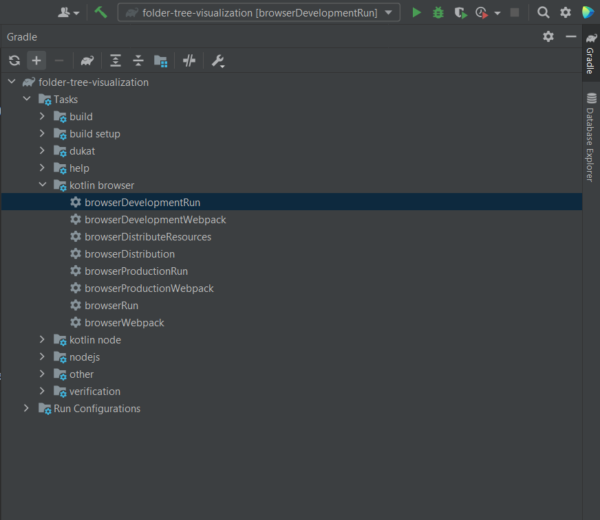
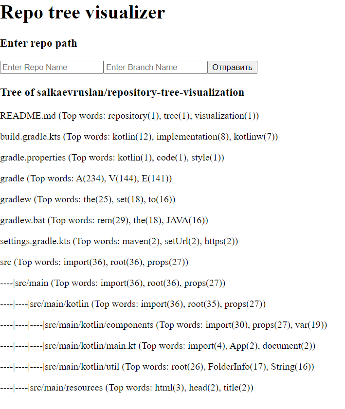

# repository-tree-visualization
## How to run:
### Command line:
1. Just use following command from repository root

   Linux: ```./gradlew run```
2. Application will run on localhost and window will open in your browser

### IntelliJ Idea:
1. Open project with IntelliJ Idea 
2. Invoke ```browserDevelopmentRun``` (can be found in gradle side panel)

3. Application will run on localhost and window will open in your browser


## Usage:
1. Enter GitHub repository (format user/repo) and branch

   For example you can use this repository (salkaevruslan/repository-tree-visualization) and branch (main)
2. Wait while data is loading (may take a few seconds)
3. To expand/collapse folder, click on it's name
